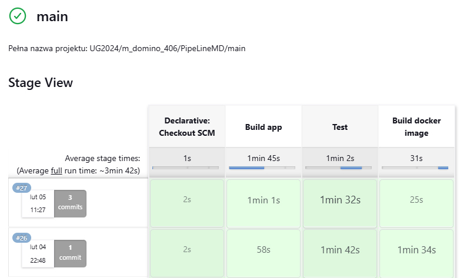
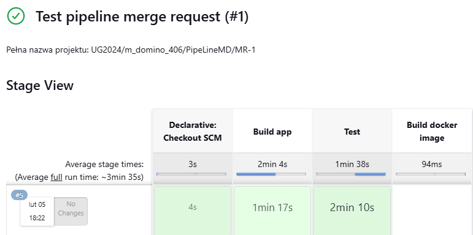

## Repozytorium przeniesione z GitLab na GitHub

To repozytorium zostało przeniesione z GitLaba na GitHuba i **nie posiada podłączonego serwera Jenkins**.





## Należy uruchomić w katalogu `kubernetes` za pomocą komendy:

linux:
```
helm install at-app . \
  --set postgres.username="{TUTAJ PODAC UZYTKOWNIKA}" \
  --set postgres.password="{TUTAJ PODAC HASLO}" \
  --set postgres.database="{TUTAJ PODAC BAZE DANYCH}"
```

windows:
```
helm install at-app . --set postgres.username="{TUTAJ PODAC UZYTKOWNIKA}" --set postgres.password="{TUTAJ PODAC HASLO}" --set postgres.database="{TUTAJ PODAC BAZE DANYCH}"
```